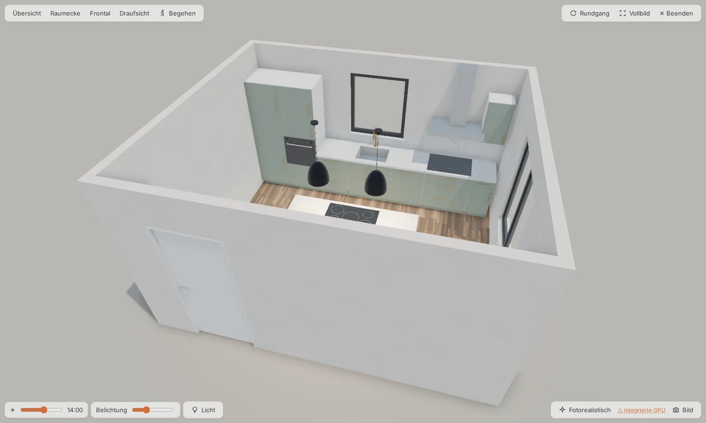
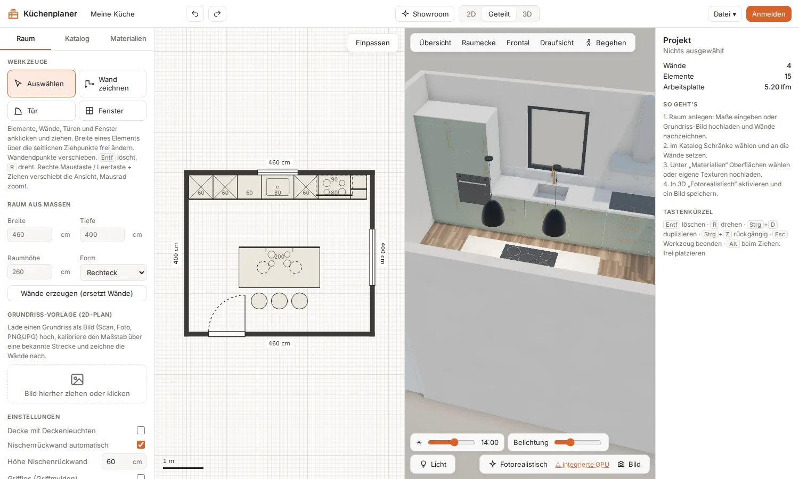
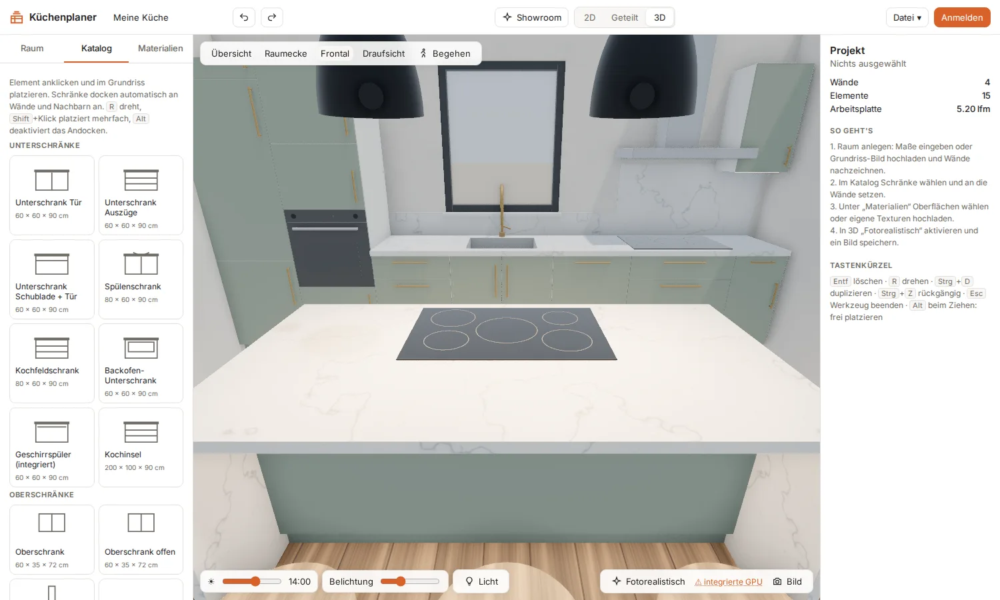
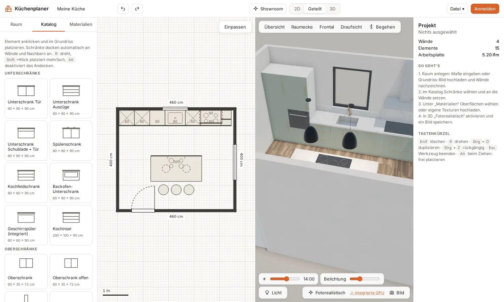
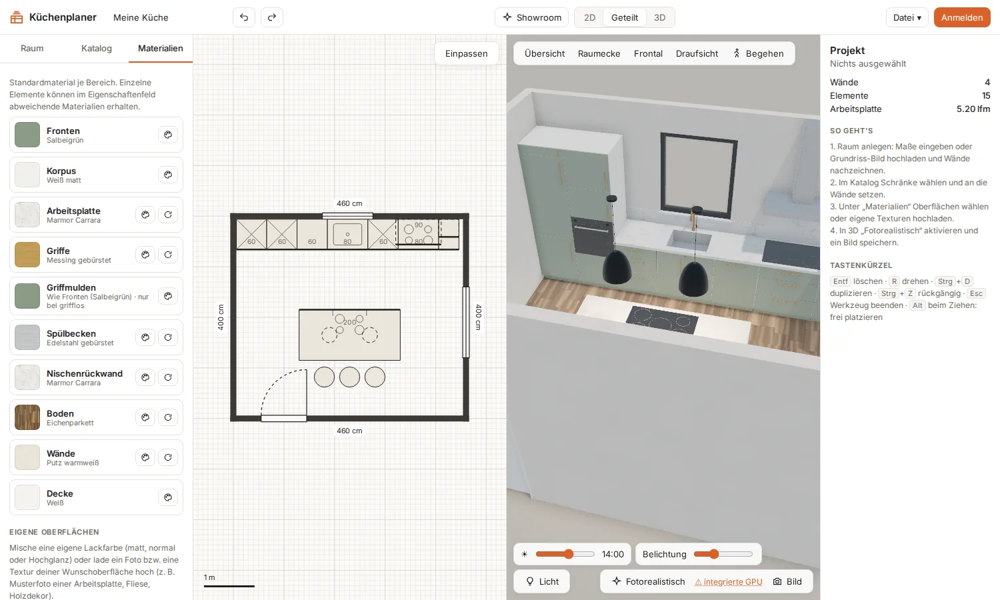
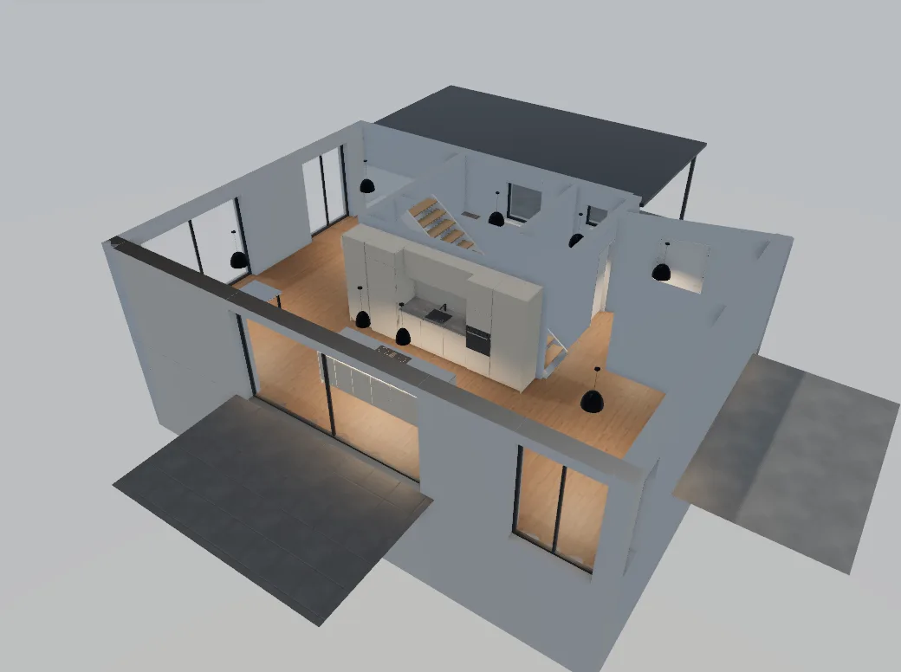

<div align="center">

# 🍳 Küchenplaner 3D

**Vom Grundriss zur fotorealistischen Küche – direkt im Browser.**

2D-Grundriss zeichnen, Schränke andocken, Oberflächen wählen und die Küche in Echtzeit-3D oder per Pathtracing ansehen.
Selbst gehostet, mit Konten und Showroom-Links zum Teilen.

[](https://nodejs.org)
[](#mit-docker-empfohlen)
[](LICENSE)
[](https://kuechenplaner.miefda.org/)
[](https://mupf-dev.github.io/kitchen-planner-3d/)

**[▶ Live-Demo ausprobieren](https://kuechenplaner.miefda.org/)**

[Funktionen](#funktionen) · [Eine echte Küche](#eine-echte-küche) · [Installation](#installation) · [Anleitung](#anleitung) · [Betrieb](#betrieb) · [Entwicklung](#entwicklung)



</div>

> [!NOTE]
> Der Küchenplaner lebt als Hausplaner in **[Zuhause](https://github.com/mupf-dev/Homemgmt)** weiter – dort für das
> ganze Haus und mit Lagerverwaltung, bei der jedes Schrankfach ein Lagerplatz ist. Dieses Repository enthält den
> eigenständigen Küchenplaner (Stand 1.0.0).

## Funktionen

<table>
<tr>
<td width="50%"></td>
<td width="50%"></td>
</tr>
<tr>
<td><b>2D und 3D gleichzeitig:</b> Jede Änderung im Grundriss erscheint sofort in der 3D-Küche.</td>
<td><b>Echtzeit-3D:</b> Schatten, Ambient Occlusion, Tageszeit und Licht – oder fotorealistisch per Pathtracing.</td>
</tr>
<tr>
<td></td>
<td></td>
</tr>
<tr>
<td><b>Katalog:</b> Unter-, Ober- und Hochschränke, Geräte, Kochinsel – docken an Wände und Nachbarn an.</td>
<td><b>Materialien:</b> Je Bereich wählbar, eigene Farben und Texturen, Online-Bibliotheken.</td>
</tr>
</table>

### 📐 Planung

- **Grundriss-Editor**: Wände mit Längeneingabe, Winkel- und Endpunktfang; Türen und Fenster; Raum aus Maßen
  (Rechteck, L-Form)
- **Grundriss als Vorlage**: Scan oder Foto hochladen, Maßstab an einer bekannten Strecke kalibrieren, nachzeichnen
- **Katalog** mit Unter-, Ober- und Hochschränken, Geräten, Kochinsel, Wangen und senkrechten Griffleisten; Breite frei
  per Ziehpunkt, Undo/Redo
- **Grifflose Küche** mit Griffmulden (waagerecht/senkrecht), Fronten mit Türen, Klappen oder 1–4 Auszügen
- **Kochinsel** mit Spaltenbreiten, Rückseite als Theke oder mit Türen, Überständen und Muldenlüfter

### 🎨 Materialien

- **Bibliothek** mit Lacken, Holz, Stein, Keramik, Metall, Fliesen, Böden (Scans von [Poly Haven](https://polyhaven.com), CC0)
- **Eigene Oberflächen**: Lackfarbe per Farbrad (matt, normal, Hochglanz) oder Foto/Textur hochladen (inkl. Normal- und
  Roughness-Map)
- **Online-Bibliothek** [Poly Haven](https://polyhaven.com) und [ambientCG](https://ambientcg.com), Import auf den Server
- **Textur ausrichten** je Bereich und Element: strecken oder kacheln, Größe, Drehung, Verschiebung
- **Farbanpassung**: Farbton, Sättigung, Helligkeit, Kontrast, Einfärben, Glanz

### 🖼️ 3D und Präsentation

- **Echtzeit** mit Schatten, Ambient Occlusion, Tageszeit und Lichtregler (Sonne, Himmel, Lampen, Weichheit)
- **Fotorealistisch**: GPU-Pathtracing, das Bild verfeinert sich fortlaufend; als PNG speichern
- **Begehen** mit WASD und Maus, Kamera-Presets (Übersicht, Raumecke, Frontal, Draufsicht)
- **Showroom**: 3D im Vollformat ohne Bedienleisten, mit Rundgang und Vollbild

### 👥 Konten und Teilen

- **Anmeldung**; das erste Konto wird Administrator. Registrierung ein/aus, Freigabepflicht, Benutzerverwaltung
- **Planungen im Konto** speichern, öffnen, umbenennen, kopieren, löschen
- **Showroom-Link**: Planung zum Ansehen ohne Anmeldung teilen (nur lesend, jederzeit deaktivierbar)
- Ohne Anmeldung funktioniert der Planer weiter – gespeichert wird dann im Browser

## Eine echte Küche

Die Planungs-Engine dieses Küchenplaners steckt heute im Hausplaner von [Zuhause](https://github.com/mupf-dev/Homemgmt).
Dort ist eine echte Küche damit geplant – grifflose Hochschränke mit Durchgang in Schrankoptik, Steinarbeitsplatte mit
Unterbauspüle und Kochinsel (Bilder aus Zuhause):

<table>
<tr>
<td width="50%"></td>
<td width="50%"></td>
</tr>
<tr>
<td><b>Küche:</b> grifflose Fronten, Durchgang zur Technik in Schrankoptik.</td>
<td><b>Im Haus:</b> Küchenzeile und Kochinsel im offenen Erdgeschoss.</td>
</tr>
</table>

## Installation

### Mit Docker (empfohlen)

```bash
git clone https://github.com/mupf-dev/kitchen-planner-3d.git
cd kitchen-planner-3d
docker compose up -d --build
```

Danach läuft der Planer unter **http://localhost:3010**. Die Daten liegen im Volume `kuechenplaner-data` (`/data` im
Container).

### Ohne Docker

Benötigt **Node.js ≥ 22.18** (eingebautes `node:sqlite`, TypeScript läuft auf dem Server ohne Build).

```bash
git clone https://github.com/mupf-dev/kitchen-planner-3d.git
cd kitchen-planner-3d
npm install
npm run build && npm start     # → http://localhost:3001
```

## Anleitung

1. **Raum anlegen** – im Reiter *Raum* Breite, Tiefe und Höhe eingeben und *Wände erzeugen*, oder mit *Wand zeichnen*
   selbst zeichnen. Alternativ einen Grundriss als Bild hochladen, mit *Maßstab* kalibrieren und nachzeichnen.
2. **Türen und Fenster** mit den gleichnamigen Werkzeugen auf eine Wand setzen.
3. **Schränke setzen** – im Reiter *Katalog* ein Element anklicken und in den Grundriss klicken. Schränke docken an Wände
   und Nachbarn an; `R` dreht, `Shift`+Klick setzt mehrfach, `Alt` platziert frei. Die Breite änderst du über die
   seitlichen Ziehpunkte.
4. **Oberflächen wählen** – im Reiter *Materialien* je Bereich (Fronten, Korpus, Arbeitsplatte, Griffe, Boden …) ein
   Material wählen. Einzelne Elemente können im Eigenschaftenfeld rechts abweichende Materialien bekommen.
5. **Ansehen** – oben zwischen *2D*, *Geteilt* und *3D* wechseln. In 3D *Fotorealistisch* einschalten und mit *Bild*
   speichern, oder *Showroom* für die Präsentation.
6. **Speichern und teilen** – *Anmelden*, die Planung im Konto speichern und einen Showroom-Link erzeugen. Ohne Konto:
   *Datei → Als Datei exportieren (.json)*.

**Tastenkürzel:** `Entf` löschen · `R` drehen · `Strg`+`D` duplizieren · `Strg`+`Z` rückgängig · `Esc` Werkzeug beenden ·
`Alt` beim Ziehen: frei platzieren

> [!TIP]
> Das Pathtracing läuft auf einer dedizierten Grafikkarte um ein Vielfaches schneller. Unter Windows im Browser
> *Einstellungen → System → Bildschirm → Grafik* die Option *Hohe Leistung* wählen – der Planer zeigt eine Anleitung,
> wenn er nur die integrierte GPU erkennt.

## Betrieb

| Variable | Standard | Bedeutung |
|----------|----------|-----------|
| `PORT` | `3001` (Docker: `3000`, nach außen `3010`) | HTTP-Port |
| `DATA_DIR` | `data/` (Docker: `/data`) | Datenbank `kuechenplaner.db` und importierte Texturen |
| `TRUST_PROXY` | – | `1` hinter einem Reverse Proxy (echte Client-IP) |
| `COOKIE_SECURE` | – | `1` bei HTTPS (Secure-Cookie) |

**Hinter einem Reverse Proxy** (Caddy, nginx, Traefik, Zoraxy …) mit HTTPS `TRUST_PROXY=1` und `COOKIE_SECURE=1` setzen.
Den Container kannst du dann ohne Host-Port direkt ins Proxy-Netz hängen (z. B. per `docker-compose.override.yml`).

**Sicherheit:** Passwörter mit scrypt und Salt; Sitzungen als zufälliges Token im HttpOnly-Cookie (30 Tage), in der
Datenbank nur als SHA-256-Hash.

## Entwicklung

```bash
npm install
npm run dev      # Vite (http://localhost:5173) und API-Server (Port 3001) gemeinsam
npm run build    # Typprüfung und Build nach dist/
```

### Aufbau

```
src/plan2d.ts                 2D-Editor: Wände, Türen/Fenster, Grundriss-Vorlage, Maßstab, Platzieren mit Andocken
src/scene3d.ts                three.js-Szene: Schatten, GTAO, Tageslicht, Begehen, Pathtracer
src/models.ts                 prozedurale Schrank- und Gerätemodelle
src/materials.ts, procedural.ts  Materialbibliothek, prozedurale Texturen, eigene Texturen
src/catalog.ts                Elementkatalog
src/state.ts                  Projektzustand, Undo/Redo, Autospeichern, JSON-Export
src/account.ts                Konto, gespeicherte Planungen, Benutzerverwaltung, Showroom-Links
server/index.ts               Express + node:sqlite: Anmeldung, Planungen, Freigaben
server/library.ts             Online-Bibliotheken (Poly Haven, ambientCG), Import auf den Server
site/                         Projekt-Website (GitHub Pages) und Screenshots
```

**Technik:** TypeScript, Vite, [three.js](https://threejs.org),
[three-gpu-pathtracer](https://github.com/gkjohnson/three-gpu-pathtracer), Express 5, eingebautes `node:sqlite`.

## Lizenz

[GNU Affero General Public License v3.0](LICENSE). Du darfst den Küchenplaner nutzen, verändern und weitergeben. Wer eine
veränderte Fassung weitergibt oder als Online-Dienst anbietet, muss den Quellcode unter derselben Lizenz offenlegen.

Bodentexturen von [Poly Haven](https://polyhaven.com) (CC0), siehe [public/textures/LIZENZ.txt](public/textures/LIZENZ.txt).
